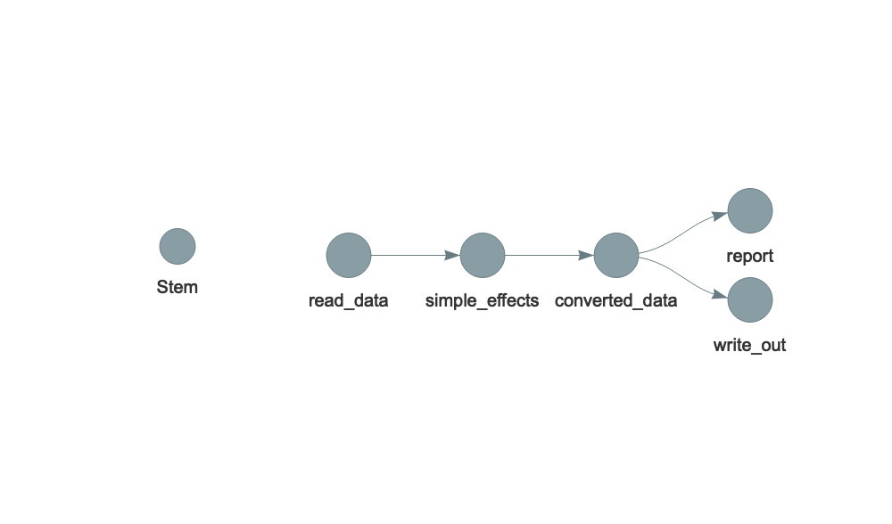

# Assumptions made

I made the following assumptions which may or may not be reasonable:

1.  That $\beta$ is equivilent to $r$ for $\beta < |.5|$ and undefined otherwise (never the case here)
2.  That, given the large sample sizes involved *Hedge's g* and *Cohen's d* where essentially equivalent and that sample sizes used to make up these effects were approximately equal in treatment and control groups.
3.  In the absence of information that could be used to construct a 2x2 contingency table that ORs and Relative Risk Ratios were equivalent and thus Relative Risk Ratios were converted to $r$ as if they were Odds ratios.
4.  External to any other information that all forms of SMD, weighted means etc. were equivilent to Cohen's d.

# Correspondence

<!--html_preserve-->

<table class="gt_table">
  <thead class="gt_header">
    <tr>
      <th colspan="3" class="gt_heading gt_title gt_font_normal" style>Coversion of effect sizes</th>
    </tr>
    <tr>
      <th colspan="3" class="gt_heading gt_subtitle gt_font_normal gt_bottom_border" style>New Effect Name - Old Effect Name</th>
    </tr>
  </thead>
  <thead class="gt_col_headings">
    <tr>
      <th class="gt_col_heading gt_columns_bottom_border gt_left" rowspan="1" colspan="1">New Name</th>
      <th class="gt_col_heading gt_columns_bottom_border gt_left" rowspan="1" colspan="1">Old Name</th>
      <th class="gt_col_heading gt_columns_bottom_border gt_center" rowspan="1" colspan="1">n</th>
    </tr>
  </thead>
  <tbody class="gt_table_body">
    <tr>
      <td class="gt_row gt_left">r</td>
      <td class="gt_row gt_left">r</td>
      <td class="gt_row gt_center">62</td>
    </tr>
    <tr>
      <td class="gt_row gt_left">d</td>
      <td class="gt_row gt_left">cohen's d</td>
      <td class="gt_row gt_center">26</td>
    </tr>
    <tr>
      <td class="gt_row gt_left">d</td>
      <td class="gt_row gt_left">g+</td>
      <td class="gt_row gt_center">13</td>
    </tr>
    <tr>
      <td class="gt_row gt_left">or</td>
      <td class="gt_row gt_left">or</td>
      <td class="gt_row gt_center">12</td>
    </tr>
    <tr>
      <td class="gt_row gt_left">b</td>
      <td class="gt_row gt_left">beta</td>
      <td class="gt_row gt_center">8</td>
    </tr>
    <tr>
      <td class="gt_row gt_left">z</td>
      <td class="gt_row gt_left">z fisher</td>
      <td class="gt_row gt_center">7</td>
    </tr>
    <tr>
      <td class="gt_row gt_left">d</td>
      <td class="gt_row gt_left">hedges' g</td>
      <td class="gt_row gt_center">6</td>
    </tr>
    <tr>
      <td class="gt_row gt_left">or</td>
      <td class="gt_row gt_left">pooled odds ratio</td>
      <td class="gt_row gt_center">6</td>
    </tr>
    <tr>
      <td class="gt_row gt_left">or</td>
      <td class="gt_row gt_left">odds ratio iv</td>
      <td class="gt_row gt_center">3</td>
    </tr>
    <tr>
      <td class="gt_row gt_left">or</td>
      <td class="gt_row gt_left">pooled fixed effect -odd ratio</td>
      <td class="gt_row gt_center">3</td>
    </tr>
    <tr>
      <td class="gt_row gt_left">d</td>
      <td class="gt_row gt_left">adjusted smd</td>
      <td class="gt_row gt_center">1</td>
    </tr>
    <tr>
      <td class="gt_row gt_left">d</td>
      <td class="gt_row gt_left">weighted mean</td>
      <td class="gt_row gt_center">1</td>
    </tr>
    <tr>
      <td class="gt_row gt_left">or</td>
      <td class="gt_row gt_left">odd ratio</td>
      <td class="gt_row gt_center">1</td>
    </tr>
    <tr>
      <td class="gt_row gt_left">or</td>
      <td class="gt_row gt_left">relative risk</td>
      <td class="gt_row gt_center">1</td>
    </tr>
    <tr>
      <td class="gt_row gt_left">z</td>
      <td class="gt_row gt_left">z</td>
      <td class="gt_row gt_center">1</td>
    </tr>
  </tbody>
  
  
</table>
<!--/html_preserve-->

# Effect Size Summary: Point Estimates

<!--html_preserve-->

<table class="gt_table">
  <thead class="gt_header">
    <tr>
      <th colspan="5" class="gt_heading gt_title gt_font_normal" style>Effect Size Summary</th>
    </tr>
    <tr>
      <th colspan="5" class="gt_heading gt_subtitle gt_font_normal gt_bottom_border" style>Descriptives by Effect Size Type</th>
    </tr>
  </thead>
  <thead class="gt_col_headings">
    <tr>
      <th class="gt_col_heading gt_columns_bottom_border gt_left" rowspan="1" colspan="1">std_eff_name</th>
      <th class="gt_col_heading gt_columns_bottom_border gt_right" rowspan="1" colspan="1">Mean</th>
      <th class="gt_col_heading gt_columns_bottom_border gt_right" rowspan="1" colspan="1">SD</th>
      <th class="gt_col_heading gt_columns_bottom_border gt_right" rowspan="1" colspan="1">Min</th>
      <th class="gt_col_heading gt_columns_bottom_border gt_right" rowspan="1" colspan="1">Max</th>
    </tr>
  </thead>
  <tbody class="gt_table_body">
    <tr>
      <td class="gt_row gt_left">b</td>
      <td class="gt_row gt_right">&minus;0.053</td>
      <td class="gt_row gt_right">0.054</td>
      <td class="gt_row gt_right">&minus;0.120</td>
      <td class="gt_row gt_right">0.010</td>
    </tr>
    <tr>
      <td class="gt_row gt_left">d</td>
      <td class="gt_row gt_right">0.091</td>
      <td class="gt_row gt_right">0.107</td>
      <td class="gt_row gt_right">&minus;0.139</td>
      <td class="gt_row gt_right">0.359</td>
    </tr>
    <tr>
      <td class="gt_row gt_left">or</td>
      <td class="gt_row gt_right">0.117</td>
      <td class="gt_row gt_right">0.101</td>
      <td class="gt_row gt_right">&minus;0.048</td>
      <td class="gt_row gt_right">0.359</td>
    </tr>
    <tr>
      <td class="gt_row gt_left">r</td>
      <td class="gt_row gt_right">0.031</td>
      <td class="gt_row gt_right">0.096</td>
      <td class="gt_row gt_right">&minus;0.157</td>
      <td class="gt_row gt_right">0.212</td>
    </tr>
    <tr>
      <td class="gt_row gt_left">z</td>
      <td class="gt_row gt_right">0.322</td>
      <td class="gt_row gt_right">0.276</td>
      <td class="gt_row gt_right">0.178</td>
      <td class="gt_row gt_right">0.999</td>
    </tr>
  </tbody>
  
  
</table>
<!--/html_preserve-->

# Project Structure

